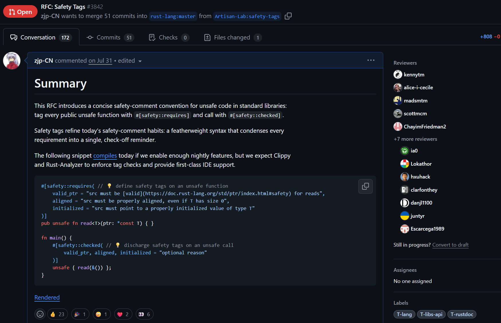

# Rust RFC#3842: Safety Tags

<SubTOC />

---

<TwoColumns left="85%" right="15%" gap="1rem">

<template #left>

</template>

<template #right>
<div class="text-xs">

<a class="text-orange-500 font-bold text-xl" href="https://github.com/rust-lang/rfcs/pull/3842" target="_blank">RFC#3842:<br> Safety Tags</a>
<br> 172 conversations <br> 12 reviewers

Rust [zulipchat thread](https://rust-lang.zulipchat.com/#narrow/channel/136281-t-opsem/topic/Safety.20Property.20System/)
<br> 60 conversations

Pre-RFC:<br>
[Rust Internals Forum](https://internals.rust-lang.org/t/pre-rfc-safety-property-system/23252)<br> 37 replies <br>
[Reddit](https://www.reddit.com/r/rust/comments/1m5k58y/prerfc_safety_property_system/)<br> 74 upvotes

</div>
</template>

</TwoColumns>


---

## Proposal

<div class="h-4"></div>

* `#![feature(safety_tags)]` and standard library adoption
  * annotate safety tags for all public unsafe APIs in libcore/libstd, along with their call sites
* Clippy: implement safety tag checking
  * Analyzing HIR nodes can be sufficient
* Rust-Analyzer: language service support on safety tags
  * Tag completion, go-to-definition, and inline documentation hover
* Rustdoc: recognize `#[safety::requires]` and better css styling

**NOTE: the proposed syntax is different from what is implemented by safety-tool as seen in the slides.**

---

## Safety Requirements Can Be Incomplete in the Standard Library

```rust
// Bad: Ptr is possibly from another allocation.
pub unsafe fn from_raw(ptr: *const T) -> Self {
    // SmartPoiner can be Box, Arc, Rc, and Weak.
    unsafe { SmartPoiner::from_raw_in(ptr, Global) }
}
```

<div class="text-xs leading-[0.3]">

| **Num** | **API**                     | **Missing SP** | **PR Num** | **Rust PR**                                             | **PR Status** |
|---------|-----------------------------|----------------|------------|---------------------------------------------------------|:-------------:|
| 1       | Arc::from_raw               | Allocated      | 1          | [134496](https://github.com/rust-lang/rust/pull/134496) |     Merged    |
| 2       | Arc::increment_strong_count | Allocated      | 1          | [134496](https://github.com/rust-lang/rust/pull/134496) |     Merged    |
| 3       | Arc::decrement_strong_count | Allocated      | 1          | [134496](https://github.com/rust-lang/rust/pull/134496) |     Merged    |
| 4       | ptr::read_unaligned         | !NonNull       | 2          | [134953](https://github.com/rust-lang/rust/pull/134953) |     Merged    |
| 5       | ptr::write_unaligned        | !NonNull       | 2          | [134953](https://github.com/rust-lang/rust/pull/134953) |     Merged    |
| 6       | Box::from_raw               | Allocated      | 3          | [135009](https://github.com/rust-lang/rust/pull/135009) |     Merged    |
| 7       | Box::from_raw_in            | Allocated      | 3          | [135009](https://github.com/rust-lang/rust/pull/135009) |     Merged    |
| 8       | Box::from_non_null          | Allocated      | 4          | [135805](https://github.com/rust-lang/rust/pull/135805) |     Merged    |
| 9       | Box::from_non_null_in       | Allocated      | 4          | [135805](https://github.com/rust-lang/rust/pull/135805) |     Merged    |
| 10      | Weak::from_raw              | Allocated      | 4          | [135805](https://github.com/rust-lang/rust/pull/135805) |     Merged    |

</div>

And fixes for more missing safety properties:

---


<div class="text-xs leading-[0.05]">

| **Num** | **API**                                        | **Missing SP**                                                 | **PR Num** | **Rust PR**                                             | **PR Status** |
|---------|------------------------------------------------|----------------------------------------------------------------|------------|---------------------------------------------------------|:-------------:|
| 11      | intrinsic::volatile_copy_nonoverlapping_memory | Volatile / ValidPtr / Aligned / NonOverlap / Alias / CopyTrait | 5          | [138309](https://github.com/rust-lang/rust/pull/138309) |     Merged    |
| 12      | intrinsic::volatile_set_memory                 | Volatile / Typed / ValidPtr / Aligned                          | 5          | [138309](https://github.com/rust-lang/rust/pull/138309) |     Merged    |
| 13      | intrinsic::typed_swap_nonoverlapping           | Typed / ValidPtr / Aligned                                     | 5          | [138309](https://github.com/rust-lang/rust/pull/138309) |     Merged    |
| 14      | alloc::ffi::CStr::from_raw                     | Alias / Owning / Allocated                                     | 6          | [137714](https://github.com/rust-lang/rust/pull/137714) |     Merged    |
| 15      | alloc::str::from_boxed_utf8_unchecked          | ValidStr                                                       | 6          | [137714](https://github.com/rust-lang/rust/pull/137714) |     Merged    |
| 16      | Arc::increment_strong_count                    | Typed                                                          | 7          | [138303](https://github.com/rust-lang/rust/pull/138303) |     Merged    |
| 17      | Arc::decrement_strong_count                    | Typed                                                          | 7          | [138303](https://github.com/rust-lang/rust/pull/138303) |     Merged    |
| 18      | Arc::increment_strong_count_in                 | Typed                                                          | 7          | [138303](https://github.com/rust-lang/rust/pull/138303) |     Merged    |
| 19      | Arc::decrement_strong_count_in                 | Typed                                                          | 7          | [138303](https://github.com/rust-lang/rust/pull/138303) |     Merged    |
| 20      | Rc::increment_strong_count                     | Typed                                                          | 7          | [138303](https://github.com/rust-lang/rust/pull/138303) |     Merged    |
| 21      | Rc::decrement_strong_count                     | Typed                                                          | 7          | [138303](https://github.com/rust-lang/rust/pull/138303) |     Merged    |
| 22      | Rc::increment_strong_count_in                  | Typed                                                          | 7          | [138303](https://github.com/rust-lang/rust/pull/138303) |     Merged    |
| 23      | Rc::decrement_strong_count_in                  | Typed                                                          | 7          | [138303](https://github.com/rust-lang/rust/pull/138303) |     Merged    |
| 24      | Box::from_raw                                  | Alias                                                          | 8          | [146870](https://github.com/rust-lang/rust/pull/146870) |    Pending    |
| 25      | Box::from_raw_in                               | Alias                                                          | 8          | [146870](https://github.com/rust-lang/rust/pull/146870) |    Pending    |
| 26      | Box::from_non_null                             | Alias                                                          | 8          | [146870](https://github.com/rust-lang/rust/pull/146870) |    Pending    |
| 27      | Box::from_non_null_in                          | Alias                                                          | 8          | [146870](https://github.com/rust-lang/rust/pull/146870) |    Pending    |
| 28      | VaListImpl::arg                                | InBound / Typed / Init                                         | 9          | [146925](https://github.com/rust-lang/rust/pull/146925) |    Pending    |
| 29      | intrinsic::va_copy                             | !Null / Allocated / Alias                                      | 9          | [146925](https://github.com/rust-lang/rust/pull/146925) |    Pending    |
| 30      | intrinsic::va_arg                              | InBound / Typed / Init                                         | 9          | [146925](https://github.com/rust-lang/rust/pull/146925) |    Pending    |
| 31      | intrinsic::va_end                              | Allocated                                                      | 9          | [146925](https://github.com/rust-lang/rust/pull/146925) |    Pending    |

</div>

---

## Granular Unsafe: How Small Is Too Small?

<div class="pt-8">

Rust languange and compiler focus on **making unsafety source and usage explicit and visually granular**.

</div>
<div class="text-xs pt-15" v-click=1>

There are also some exotic visual unsafety proposals from IRLO:
* 2023-10: [Ability to call unsafe functions without curly brackets](https://internals.rust-lang.org/t/ability-to-call-unsafe-functions-without-curly-brackets/19635/22)
  proposes `unsafe unsafe_fn()` without curly brackets `{}`
* 2024-10: [Detect and Fix Overscope unsafe Block](https://internals.rust-lang.org/t/detect-and-fix-overscope-unsafe-block/21660/19)
  * 2025-01: [RFC: Add safe blocks](https://github.com/rust-lang/rfcs/pull/3768)
    proposes `unsafe { safe { /* code */ } }`
* 2025-02: [Pre-RFC: Single function call unsafe](https://internals.rust-lang.org/t/pre-rfc-single-function-call-unsafe/22343)
  proposes the `.unsafe` postfix

</div>

---

Clippy lints step a bit further towards the <span class="text-orange-500 font-bold">semantic unsafety</span>:
* `missing_safety_doc` checks the existence of `# Safety` section in doc comments.
* `multiple_unsafe_ops_per_block` checks the occurence of unsafe operations in `unsafe { }`.

<Info>
<div class="font-bold text-lg">

Safety tags define the unsafety <span class="text-red-500">at coarse semantic granularity</span>, not just visually! That means
* splitting \# Safety doc section from paragraphs into referencable entities,
* condensing long texts of a safety requirement into single identity.

</div>
</Info>

---

## Other Motivations

<div class="h-5"></div>

3. Safety invariants have no <span class="text-red-500 font-bold">SemVer</span> capability:
  * Downstream crates may be unaware of changes on safety requirements,
    and thus exposed to risks.
  * Tags are a part of API; definition change can be SemVer-breaking,
    so **safety invariants evolve explicitly**.

<div class="h-5"></div>

4. Suit for <span class="text-red-500 font-bold">daily</span> projects:
  * Establish shared vocabulary and **forge consensus in everyday review**.
  * By contrast, formal contracts excel verifying code at extremely fine semantic granularity,
    but they are much harder to maintain.


