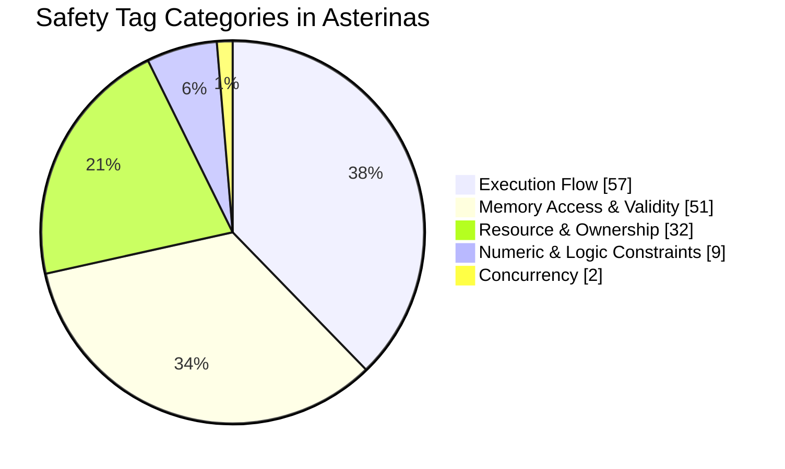
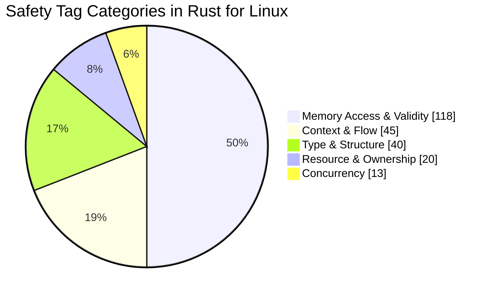

# Work in Progress

<SubTOC />

---

## Draft Annotations in Asterinas

<div class="h-4"></div>

<div class="text-xl">

* Annotated [ostd](https://github.com/Artisan-Lab/tag-asterinas/tree/2026-11/ostd) fork
* Tags are defined in a [TOML file](https://github.com/Artisan-Lab/tag-asterinas/blob/2025-11/ostd/safety-tags.toml)
* Safety properties are summarized in [Asterinas-safety-properties.md](https://github.com/Artisan-Lab/tag-std/blob/main/Asterinas-safety-properties.md)
* Asterinas RFC is under inital delibration

</div>

---

<AsterinasBoot />

---

<TwoColumns left="60%" right="40%" gap="0">
<template #left>

<div class="text-xs">

*   **Execution Flow (57)**: PostToFunc(18), Context(12), Memo(11), NotPostToFunc(7), OriginateFrom(6), Section(2), NotPriorToFunc(1)
*   **Memory Access & Validity (51)**: Valid(18), ValidAccessAddr(10), KernelMemorySafe(6), ValidBaseAddr(6), ValidInstanceAddr(4), MutAccess(2), Unaccessed(2), UserSpace(2), NonModifying(1)
*   **Resource & Ownership (32)**: CallOnce(15), OwnedResource(6), Forgotten(5) ...
*   **Numeric & Logic Constraints (9)**: Bounded(5), Eq(2), Ge(1), Ne(1)
*   **Concurrency (2)**: LockHeld(1), Sync(1)

</div>

<div class="text-lg text-red-500 font-bold">
28 safety tags <br>
151 total occurences
</div>
</template>

<template #right>



</template>
</TwoColumns>

---

## Draft Annotations in Rust for Linux

<div class="h-4"></div>

<div class="text-xl">

* Annotated [rust/kernel](https://github.com/Artisan-Lab/tag-rust-for-linux/tree/rust-next/rust/kernel) fork
* Tags are defined in [sp-rust-for-linux.toml](https://github.com/Artisan-Lab/tag-std/blob/main/safety-tool/assets/sp-rust-for-linux.toml)
  * [sp-core.toml](https://github.com/Artisan-Lab/tag-std/blob/main/safety-tool/assets/sp-core.toml) is also utilized, so basic tags 
    are out of the box (like ValidPtr, Eq, InBound, ...)
* Safety properties are summarized in [R4L-safety-properties.md](https://github.com/Artisan-Lab/tag-std/blob/main/R4L-safety-properties.md)

</div>

---

<TwoColumns left="60%" right="40%" gap="0">
<template #left>

<div class="text-xs">

*   **Memory Access & Validity (118)**: ValidPtr(35), ValidNum(13), Init(11), ValidInstance(11), Alive(10), ValidWrite(10), ValidRead(6), ValidCStr(4), Allocated(3), NonNull(3), ValidFile(3), ValidMemory(3), ValidVma(3) ...
*   **Execution Flow (45)**: CalledBy(29), OriginateFrom(15), PostToFunc(1)
*   **Type Invariant (42)**: Typed(9), NonZero(8), Associated(6), Align(3), InList(3), ContainerOf(2), Equal(2), NonExist(2), Think_Exist(2), Empty(1) ...
*   **Resource & Ownership (18)**: Access(5), CallOnce(5), Owning(2) ...
*   **Concurrency (13)**: LockHold(4), NonData_race(4), CurThread(2), NonConcurrent(2), AnyThread(1)

</div>

<div class="text-lg text-red-500 font-bold">
47 safety tags <br>
236 total occurences
</div>
</template>

<template #right>



</template>
</TwoColumns>

---

## Better Tooling: Enhanced API Doc Generation

<div class="h-3"></div>

Backfill the `desc` string from tag definition:

```toml
[tag.Allocated]
args = [ "p", "T", "len", "A" ]
desc = "the memory range `[{p}, {p} + sizeof({T})*{len})` must be allocated by allocator `{A}`"
expr = "∀ i ∈ 0..sizeof(T)∗len, allocator(p + i) = A"
url = "https://doc.rust-lang.org/nightly/std/ptr/index.html#allocation"
```

<div class="h-1"></div>

```rust
#[safety::requires(Allocated(slot, T, 1, _))]
unsafe fn foo<T>(slot: *mut T) { ... }
```

The `#[safety::requires]` proc-macro will be expanded to `#[doc]` attribute:

```rust
#[doc = "the memory range `[slot, slot + sizeof(T)*1)` must be allocated by allocator `_`"]
```

---


---

## Better Tooling: Language Server Support in VSCode and Neovim


<div class="text-lg text-red-500 text-center font-bold"> Tag Auto-Completion </div>

---
hideInToc: true
---

## Better Tooling: Language Server Support in VSCode and Neovim


<div class="text-lg text-red-500 text-center font-bold"> Safety Documentation Hovering </div>

---

## Plans

<div class="h-4"></div>

<div class="text-xl">

* Facilitate alignment between the design and devlopment team in Asterinas. 
* Polish the tags in Rust for Linux. (It's not pure Rust code!)
* Integrate with RAPx on [safety property verification](https://artisan-lab.github.io/RAPx-Book/6.4-unsafe.html).

</div>
